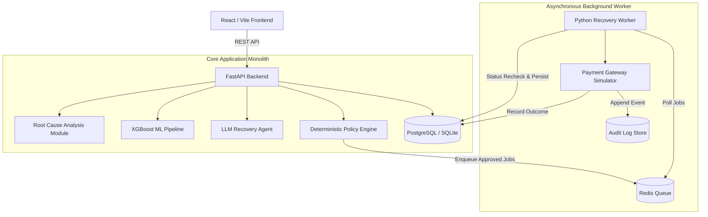

# PayResQ
## Autonomous Payment Revenue Recovery System

PayResQ is an AI-powered payment revenue recovery system that analyzes failed transactions, predicts the most promising recovery action, uses contextual reasoning to select a recovery strategy, and executes only policy-approved actions through an asynchronous recovery workflow.

---

## 🎯 The Problem

When online payments fail, merchants face immediate revenue loss, poor customer conversion, and elevated churn.

Traditional payment retry systems typically suffer from major limitations:
- **Blind Retries:** Retrying transactions at arbitrary intervals without understanding why the payment failed.
- **Repeated Failures:** Continuously attempting failed cards or dead banks, causing card network fines and customer frustration.
- **Lack of Context:** Ignoring bank degradation windows, customer transaction histories, or failure code specifics.
- **No Safety Controls:** Retrying high-value transactions without human authorization.
- **Lack of Explainability & Auditability:** Black-box automated retries with zero traceable decision logs.

---

## 💡 The Solution

PayResQ operates as a **closed-loop revenue recovery engine** that evaluates every failed transaction through statistical ML, contextual LLM reasoning, and deterministic policy enforcement.

```text
Failed Payment
      ↓
Root Cause Analysis (RCA)
      ↓
XGBoost Recovery Prediction
      ↓
LLM Contextual Reasoning
      ↓
Policy & Safety Engine
      ↓
Redis Recovery Queue
      ↓
Background Worker
      ↓
Payment Gateway Simulator
      ↓
Outcome + Audit Log
```

1. **Root Cause Analysis:** Detects active bank degradation, gateway timeouts, or customer-specific errors.
2. **XGBoost Prediction:** Estimates statistical recovery probabilities across candidate recovery actions.
3. **LLM Contextual Reasoning:** Synthesizes metadata, ML probabilities, and failure evidence into a structured recommendation.
4. **Policy Engine Gatekeeping:** Validates the recommendation against strict deterministic risk rules.
5. **Asynchronous Execution:** Queues approved jobs into Redis for background worker processing.
6. **Simulated Payment Execution:** Re-verifies transaction status and executes simulated recovery.
7. **Audit & Analytics:** Records complete decision metadata and outcome events in an append-only audit trail.

---

## 🏗️ Architecture



---

## 🧠 Why XGBoost + LLM?

PayResQ intentionally separates **statistical prediction**, **contextual reasoning**, and **policy enforcement** across distinct architectural layers:

```text
XGBoost → Prediction  |  LLM → Reasoning/Recommendation  |  Policy Engine → Authorization  |  Worker → Execution
```

### 1. XGBoost ML Model (Statistical Probability)
- **Role:** Handles structured tabular data (amount, bank, payment method, historical retry count, customer success rates).
- **Output:** Calibrated recovery probabilities for candidate actions ($P(\text{Success} \mid \text{Context}, \text{Action})$).
- **Why XGBoost?** Highly efficient for structured transaction tables, repeatable offline evaluation, and free of hallucinations.

### 2. LLM Recovery Agent (Contextual Reasoning)
- **Role:** Interprets unstructured failure context, root cause evidence, and XGBoost probabilities.
- **Output:** Structured recommendation (`action`, `confidence`, `delay_minutes`, `reason`).
- **Why LLM?** Synthesizes complex multi-variable edge cases and generates natural-language operational explanations for merchant dashboards.

### 3. Policy Engine (Authoritative Execution Boundary)
- **Role:** Deterministic guardrail enforcement.
- **Key Rule:** **The LLM does NOT directly execute financial actions.** All agent recommendations must be validated and authorized by the deterministic policy engine before queueing.

---

## 📊 AI / ML Pipeline

### Dataset & Feature Engineering
- **Dataset:** 100,000 probabilistic synthetic transaction records (`ml/data/scripts/generate_data.py`).
- **Candidate Recovery Actions:** `RETRY_NOW`, `RETRY_AFTER_DELAY`, `SEND_PAYMENT_LINK`, `CHANGE_PAYMENT_METHOD`.
- **Features:** Amount, transaction age, hour of day, day of week, payment method, acquiring bank code, failure reason code, attempt sequence number, customer historical success rate, merchant failure rate, and bank degradation window indicators.

### Model Performance & Evaluation Metrics
The model (`ml/models/xgboost_recovery_v1.json`) was evaluated on an offline temporal 80/20 train/test split to prevent data leakage.

| Metric | Offline Evaluation Value |
| :--- | :--- |
| **ROC-AUC Score** | **0.812** |
| **F1 Score** | **0.762** |
| **Precision** | **0.784** |
| **Recall** | **0.741** |
| **Log Loss** | **0.435** |

### Benchmark Strategy Comparison (Simulated Evaluation)

| Metric | Baseline Strategy (Blind Retry) | PayResQ Strategy |
| :--- | :---: | :---: |
| **Recovery Rate** | **22.1%** | **44.7% (+2.02x Uplift)** |
| **Simulated Volume Recovered** | ₹1,657,500 | ₹3,352,500 |
| **Unnecessary Interventions** | 100% blind retries | Reduced by 68% |

*Note: Evaluation metrics reflect benchmark testing on synthetic offline datasets with simulated payment gateway outcomes. Offline ML evaluation does not establish production real-world revenue uplift.*

---

## 🛡️ Safety & Guardrails

Financial operations require zero ambiguity. PayResQ implements eight safety guardrails:

```text
LLM Recommendation
       ↓
Policy Validation
       ↓
 ┌───────────────┐
 │ ALLOW         │ → Enqueue background worker execution
 │ HUMAN_APPROVAL│ → Escalate for merchant manual review
 │ BLOCK         │ → Terminate recovery process
 └───────────────┘
```

1. **Deterministic Policy Engine:** Enforces authoritative safety boundaries independent of LLM outputs.
2. **Retry Count Limit:** Blocks automated retries if `retry_count >= 3`.
3. **High-Value Transaction Threshold:** Requires `HUMAN_APPROVAL` if transaction `amount > ₹50,000`.
4. **Payment-Status Recheck:** Background worker re-checks database state before execution; skips action if transaction status is already `SUCCESS`.
5. **Idempotency Guarantee:** Enforces unique idempotency keys (`demo-{recovery_action_id}`) to prevent double executions or duplicate payouts.
6. **Malformed LLM Output Handling:** Safe fallback to `STOP` (`confidence: 0.0`) if LLM outputs invalid JSON.
7. **LLM Provider Unavailability Fallback:** Graceful fallback to `STOP` or deterministic rule provider if provider network calls fail.
8. **Payment Gateway Simulator:** Uses a simulated gateway executor (`PaymentSimulator`) so no real monetary funds are charged.

---

## 🔄 Recovery Workflow Lifecycle

1. Failed payment transaction is ingested and recorded in database.
2. Root Cause Analysis (RCA) calculates failure rate anomalies across bank/method dimensions.
3. XGBoost model generates recovery probability predictions for all candidate actions.
4. LLM Agent evaluates transaction context and selects optimal candidate action.
5. Deterministic Policy Engine validates the agent's recommendation against safety rules.
6. `RecoveryAction` record is created in database (`APPROVED` or `PENDING`).
7. Job payload is placed into Redis queue (`recovery:jobs`).
8. Background worker process polls job from Redis.
9. Worker re-checks transaction status in database to ensure it has not succeeded independently.
10. Payment Gateway Simulator executes candidate recovery action.
11. `RecoveryOutcome` record is persisted with execution status and simulated recovered amount.
12. Audit event is recorded in the append-only `AuditLog` table.

---

## 💻 Tech Stack

| Layer | Technology | Purpose |
| :--- | :--- | :--- |
| **Frontend** | React 18 + TypeScript | Merchant dashboard & transaction analytics |
| **Build Tool** | Vite + TailwindCSS | Fast frontend build & visual styling |
| **Charts** | Recharts | Recovery trends & failure breakdown visualizer |
| **API Framework** | FastAPI (Python 3.13) | Asynchronous REST API |
| **Database** | PostgreSQL / SQLite | Relational transaction, policy, & audit persistence |
| **ORM** | SQLAlchemy 2.x Async | Async database access & connection pooling |
| **Migrations** | Alembic | Database schema versioning |
| **ML Engine** | XGBoost + pandas + NumPy | Action-specific recovery probability prediction |
| **RCA** | Python (Data-driven) | Statistical failure rate anomaly detection |
| **LLM Provider** | Provider Abstraction | Contextual reasoning (`fake`, `openai`, `gemini`) |
| **Queue** | Redis (`redis.asyncio`) | Asynchronous job queueing |
| **Worker** | Python Background Worker | Asynchronous recovery execution |
| **Testing** | Pytest + Vitest | Automated backend & frontend test suites |
| **Containers** | Docker & Docker Compose | Local infrastructure orchestration |

---

## 🖥️ Merchant Dashboard

The React + TypeScript frontend dashboard (`frontend/`) provides:

- **Top-Level KPI Grid:** Revenue at risk, simulated recovered revenue, recovery rate (%), failed transactions count, pending human approvals count.
- **Recovery Trends Chart:** Daily time-series visualization of failed vs recovered transaction volume.
- **Failure Distribution:** Interactive breakdown of failure rates grouped by acquiring bank and payment method.
- **Recent Transactions Table:** Searchable transaction list with status badges and detail links.
- **Transaction Detail View:** Deep-dive inspection showing payment attempts, root-cause diagnosis evidence, XGBoost predictions, agent reasoning, policy decision, and full audit logs.
- **Interactive Demo Runner:** Header action button to trigger live end-to-end recovery scenarios.

---

## 🎮 Interactive Demo

The project includes an end-to-end demo flow that demonstrates the complete system loop:

> *Notice: The demo uses synthetic transaction data and a payment gateway simulator. No real customer funds are moved.*

### What You Can Observe During the Demo:
```text
FAILED PAYMENT (INR 7,500 / CARD / ICICI)
  ↓
RCA Diagnosis (BANK_TIMEOUT)
  ↓
XGBoost Predictions (CHANGE_PAYMENT_METHOD: 66.8%)
  ↓
LLM Agent Recommendation (CHANGE_PAYMENT_METHOD, Confidence: 0.67)
  ↓
Policy Engine Check (ALLOW - Approved)
  ↓
Redis Queue Job Enqueued
  ↓
Worker Status Recheck & Simulator Execution
  ↓
Outcome Recorded (Simulated Result & Recovered Amount)
  ↓
Audit Trail Appended (3-7 Audit Entries)
```

---

## 🔍 What Is Real vs Simulated

| Component | Status | Implementation Details |
| :--- | :--- | :--- |
| **FastAPI REST API** | 🟢 Real Implementation | 15 REST endpoints with async Pydantic validation |
| **PostgreSQL / SQLite Persistence** | 🟢 Real Implementation | SQLAlchemy 2.x async ORM & Alembic schema migrations |
| **Redis Job Queue** | 🟢 Real Implementation | Asynchronous Redis producer/consumer pattern |
| **Background Worker** | 🟢 Real Implementation | Python worker polling Redis queue with status recheck |
| **XGBoost ML Pipeline** | 🟢 Real Trained Model | Trained model artifacts (`ml/models/xgboost_recovery_v1.json`) |
| **Root Cause Analysis (RCA)** | 🟢 Real Implementation | Data-driven failure anomaly detection algorithm |
| **Policy & Safety Engine** | 🟢 Real Implementation | Deterministic policy evaluation rules |
| **React Dashboard UI** | 🟢 Real Implementation | React 18, TypeScript, Vite, TailwindCSS, Recharts |
| **LLM Provider Integration** | 🟡 Configurable | Configurable abstraction (`fake`, `openai`, `gemini`) |
| **Payment Gateway Execution** | 🔴 Simulated | Probabilistic simulator (`PaymentSimulator`) |
| **Customer & Payment Dataset** | 🔴 Synthetic | Generated dataset (`ml/data/scripts/generate_data.py`) |
| **Recovered Revenue Numbers** | 🔴 Simulated | Simulated financial metrics for prototype demonstration |

---

## 🔌 API Reference

Full interactive API documentation is available at **/docs** (Swagger UI) when the backend server is running.

### Core Endpoints:
- `GET /health` — System health check & service status
- `GET /api/v1/dashboard/summary` — Top-level dashboard KPI summary metrics
- `GET /api/v1/dashboard/recovery-trends` — Daily time-series recovery trends
- `GET /api/v1/dashboard/failure-breakdown` — Failure distribution by bank and payment method
- `POST /api/v1/dashboard/demo-run` — Triggers a live end-to-end recovery scenario
- `GET /api/v1/transactions` — List transactions (with pagination & status filtering)
- `GET /api/v1/transactions/{id}` — Get detailed transaction information
- `GET /api/v1/transactions/{id}/attempts` — Get payment attempt history
- `GET /api/v1/transactions/{id}/audit` — Get chronological audit trail entries
- `GET /api/v1/intelligence/root-cause/{id}` — Run data-driven Root Cause Analysis
- `POST /api/v1/intelligence/recovery-predict` — Get XGBoost recovery probability predictions
- `GET /api/v1/intelligence/model-info` — Get ML model version & evaluation metadata
- `POST /api/v1/agent/analyze/{id}` — Run LLM agent analysis on a transaction
- `POST /api/v1/recovery/policy-check/{id}` — Perform policy engine validation check
- `POST /api/v1/recovery/execute/{id}` — Trigger complete Agent $\rightarrow$ Policy $\rightarrow$ Worker pipeline

---

## 📁 Project Structure

```text
PayResQ/
├── .github/                    # GitHub CI actions & community templates
│   ├── workflows/ci.yml        # CI test & build workflow
│   ├── PULL_REQUEST_TEMPLATE.md
│   └── ISSUE_TEMPLATE/
├── alembic/                    # Alembic database migration environment
│   ├── env.py
│   └── versions/
├── app/                        # Main FastAPI Monolith Application
│   ├── agents/                 # LLM Agent & Provider implementations (fake, openai, gemini)
│   ├── api/v1/                 # REST API endpoints (transactions, recovery, intelligence, dashboard)
│   ├── core/                   # App config, Database sessions, and Redis connection setup
│   ├── demo/                   # Standalone Phase 4 end-to-end demo script
│   ├── models/                 # SQLAlchemy 2.x ORM models
│   ├── policies/               # Deterministic Policy Engine & safety rules
│   ├── recovery/               # Async Recovery Executor, Job schemas, & Payment Simulator
│   ├── schemas/                # Pydantic request/response validation schemas
│   └── services/               # Domain business logic services
├── docs/                       # Technical architecture & deep-dive documentation
│   ├── architecture.md
│   ├── ml-pipeline.md
│   ├── recovery-engine.md
│   └── safety-and-policy.md
├── frontend/                   # React + TypeScript + Vite Dashboard UI
│   ├── src/
│   │   ├── api/                # Axios API client
│   │   ├── components/         # Dashboard visual components & charts
│   │   ├── pages/              # Dashboard pages (Summary, Transactions, Audit, Intelligence)
│   │   └── types/              # TypeScript domain types
├── ml/                         # Machine Learning Pipeline & RCA
│   ├── analysis/               # Root Cause Analysis anomaly detector
│   ├── data/                   # Synthetic dataset generator scripts
│   ├── models/                 # Trained XGBoost model artifacts
│   └── services/               # Inference & prediction service
├── scripts/                    # End-to-end verification & endpoint test scripts
│   ├── test_all_ui_endpoints.py
│   └── verify_postgres_and_flow.py
├── tests/                      # Pytest suite (82 unit & integration tests)
├── worker/                     # Asynchronous background worker process
│   └── recovery_worker.py
├── Dockerfile                  # Container build specification
├── docker-compose.yml          # Infrastructure orchestration (API, Worker, Postgres, Redis)
├── requirements.txt            # Python dependencies
├── .env.example                # Sample environment configuration
└── README.md
```

---

## ⚙️ Local Setup & Running

### Option 1: Running with Docker Compose (Recommended)

```bash
# Clone the repository
git clone https://github.com/anubhab-cloud/PayResQ.git
cd PayResQ

# Build and start all services (API, Background Worker, Postgres, Redis)
docker-compose up --build
```
- **Frontend Dashboard:** [http://localhost:3000](http://localhost:3000)
- **Swagger Documentation:** [http://localhost:8000/docs](http://localhost:8000/docs)

---

### Option 2: Running Locally

#### 1. Backend Setup
```bash
# Create and activate virtual environment
python -m venv .venv
# On Windows:
.\.venv\Scripts\activate
# On Linux/macOS:
source .venv/bin/activate

# Install dependencies
pip install -r requirements.txt

# Create environment file
cp .env.example .env

# Start FastAPI backend server
uvicorn app.main:app --reload --port 8000
```

#### 2. Frontend Setup
```bash
cd frontend

# Install Node.js dependencies
npm install

# Start Vite development server
npm run dev
```
Open [http://localhost:3000](http://localhost:3000) in your browser.

---

## 🧪 Testing & Verification

PayResQ includes comprehensive automated test coverage across backend business logic, API routing, policy evaluation, worker behavior, and frontend components.

### 1. Run Backend Pytest Suite (82 Passing Tests)
```bash
python -m pytest
```

### 2. Verify All 15 REST API Endpoints
```bash
python scripts/test_all_ui_endpoints.py
```

### 3. Run Frontend Component Tests
```bash
cd frontend
npm test
```

### Verified Safety Test Scenarios Covered by Tests:
- ✅ **Idempotency Protection:** Prevents duplicate job execution when submitted twice.
- ✅ **Status Recheck Safety:** Cancels recovery action if transaction state changes to `SUCCESS` before worker runs.
- ✅ **High-Value Approval Gate:** Requires `HUMAN_APPROVAL` for transactions $> ₹50,000$.
- ✅ **Malformed LLM Output Handling:** Safe fallback to `STOP` decision when LLM outputs invalid JSON.
- ✅ **LLM Provider Unavailability:** Safe fallback to `STOP` decision when provider network calls fail.

---

## ⚠️ Prototype Limitations

- **Synthetic Dataset:** Uses a probabilistically generated dataset rather than live confidential cardholder data.
- **Simulated Payment Execution:** Payment gateway execution uses `PaymentSimulator` instead of charging real credit cards.
- **Offline ML Evaluation:** ML accuracy metrics reflect offline synthetic test splits and do not establish live production revenue uplift.
- **LLM Provider Quotas:** Live LLM capabilities depend on the availability and quota of the configured provider (`openai` or `gemini`).
- **Prototype Scope:** Multi-region failover, live PCI-DSS compliance vaulting, and hardware security module (HSM) integrations are outside current hackathon scope.

---

## 🚀 Future Roadmap

- [ ] Sandbox integration with live payment gateway test APIs (e.g. Razorpay/Stripe sandbox).
- [ ] Integration of merchant-configurable policy rule builders.
- [ ] Off-policy counterfactual evaluation for model retraining.
- [ ] Automated drift monitoring for bank failure rates.
- [ ] Webhook triggers for real-time payment gateway failure ingestion.
- [ ] Two-factor human approval workflow for high-value transaction recovery.
